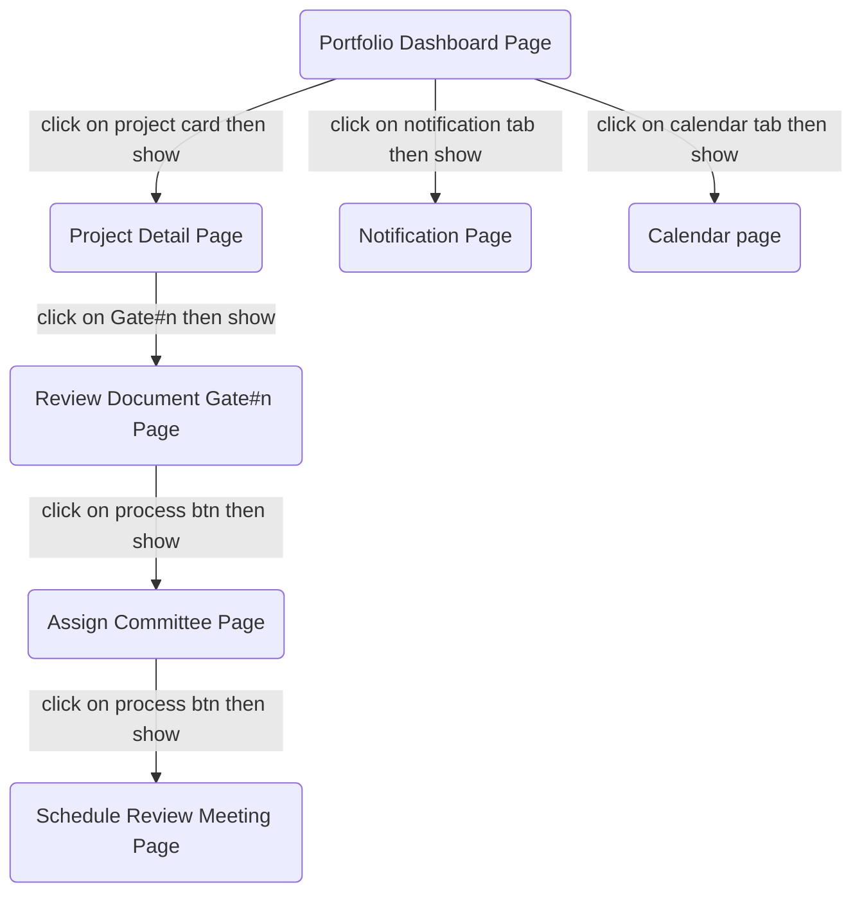

# SCGC Web Demo

## Table of Contents

- [Getting Started](#getting-started)
  - [Installation](#installation)
  - [Development](#development)
- [Building for Production](#building-for-production)
- [Flow](#flow)
- [Deployment](#deployment)
  - [Docker Deployment](#docker-deployment)
  - [DIY Deployment](#diy-deployment)
- [Styling](#styling)

## Getting Started

### Installation

Install the dependencies:

```bash
npm install
```

### Development

Start the development server with HMR:

```bash
npm run dev
```

Your application will be available at `http://localhost:5173`.

## Building for Production

Create a production build:

```bash
npm run build
```

## Flow

### Miro

https://miro.com/app/board/uXjVJOVHyq0=/

### Diagram



## Deployment

### Docker Deployment

To build and run using Docker:

```bash
docker build -t my-app .

# Run the container
docker run -p 3000:3000 my-app
```

The containerized application can be deployed to any platform that supports Docker, including:

- AWS ECS
- Google Cloud Run
- Azure Container Apps
- Digital Ocean App Platform
- Fly.io
- Railway

### DIY Deployment

If you're familiar with deploying Node applications, the built-in app server is production-ready.

Make sure to deploy the output of `npm run build`

```
├── package.json
├── package-lock.json (or pnpm-lock.yaml, or bun.lockb)
├── build/
│   ├── client/    # Static assets
│   └── server/    # Server-side code
```

## Styling

This template comes with [Tailwind CSS](https://tailwindcss.com/) already configured for a simple default starting experience. You can use whatever CSS framework you prefer.

---

Built with ❤️ using React Router.
